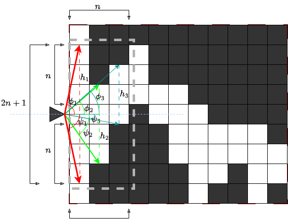
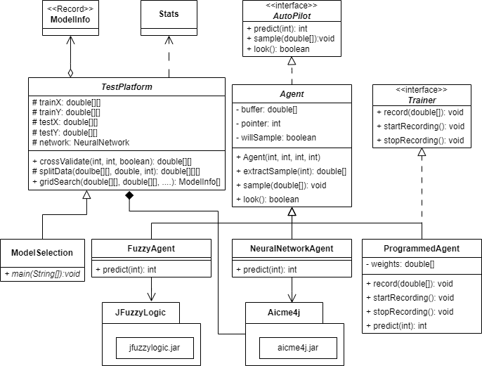
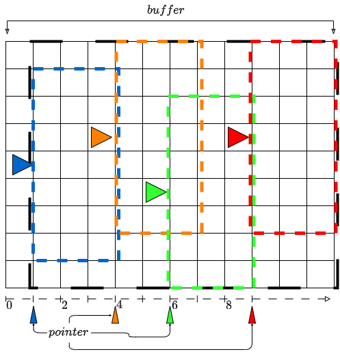
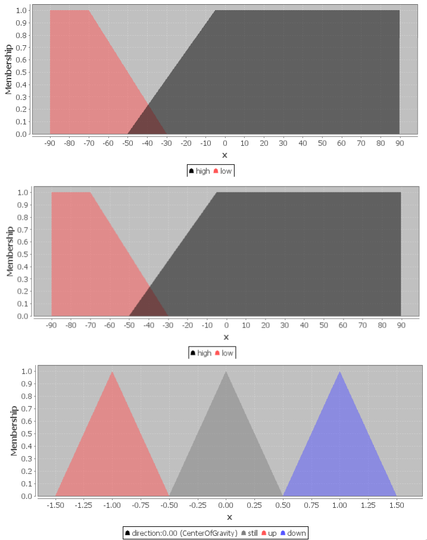
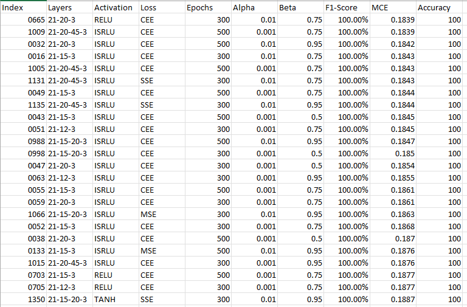

# Artificial Intelligence Assignment


## Requirements
 `Java SE Runtime Environment`


# Teaching a Neural Network to Fly Autopilot

## Overview
This project aims to train an Automatic Neural Network to navigate through an endless horizontally scrolling tunnel without clipping any of the edges. A programmed agent was designed to generate training data for the Neural Network, which was used for model selection through a grid search approach. The project's main metrics for evaluation were the F1-Accuracy score and Mean Cross-Entropy Loss. The best model achieved a test accuracy score of 100% with an MCCE loss of 0.1839.


## How to Run the Project
1. Clone the repository to your local machine. 
     ```
    git clone git@github.com:intotito/ai_assignment.git
    ``` 
    ```
    git clone github.com/intotito/ai_assignment.git
    ```
2. Navigate to the project directory.
3. Run the following command to run the application. 

    Windows:
    ```
    ./gradlew.bat run
    ```
    Linux:
    ```
    ./gradlew run
    ```

## Table of Contents

- [Abstract](#abstract)
- [Introduction](#introduction)
- [Agent Design](#agent-design)
- [Sampling](#sampling)
- [Feature Design](#feature-design)
- [Model Selection](#model-selection)
- [Extra - FuzzyAgent](#extra---fuzzyagent)
- [Conclusion](#conclusion)
- [Appendix A: Figures & Tables](#appendix-a-figures--tables)

## Abstract

The goal of this project is to train an Automatic Neural Network to navigate through an endless horizontally scrolling tunnel without clipping any of the edges. A programmed agent was designed to generate training data for the Neural Network. Model selection was done using a grid search approach with varying hyperparameters. The best model achieved a test accuracy score of 100% and MCCE loss of 0.1839. Additionally, a Fuzzy Logic-based autopilot agent was implemented.

## Introduction


**Figure 1: Stage**


The game consists of a 30x20 grid where the ship is at a fixed column and can navigate vertically. A programmed agent capable of flawlessly navigating the tunnel was designed to generate training data. The agent’s navigation algorithm aims to navigate the ship through the middle of the opening in the next `n` columns with respect to the ship's current location. A horizon value of `n=3` was chosen for its smooth navigation performance.

## Agent Design




**Figure 2: UML Diagram**

All autopilot agents implement the base abstract class `Agent`, which provides functionality for sampling and preprocessing data.

### Programmed Agent

The `ProgrammedAgent` class predicts the next step by evaluating the weighted center of the cave's opening using the softmax function. The final prediction (UP, DOWN, or STAY) is determined by the position of the weighted center relative to the ship's current row.

## Sampling


**Figure 3: Sampling Technique**
### Buffering

Data sampling involves storing the grid beyond the ship’s location in a buffer, which is continuously consumed until exhausted. The buffer size is defined by the stage height and the remaining width from the ship's position to the stage's end.

### Feature Extraction

The agent extracts relevant features from the buffer, specifically the next `n` columns with a height of `2n + 1`. The relevant features are extracted with a complexity of O(|F|), where |F| = `n x (2n + 1)`.

## Feature Design

A horizon value of `n=3` resulted in 21 input features for the Neural Network. The output consists of 3 nodes corresponding to the possible actions (UP, DOWN, STAY).

## Model Selection

A grid search algorithm was used to find the best model by varying hyperparameters such as learning rate (α), momentum (β), epochs, activation functions, loss functions, and the number of nodes per layer and hidden layers. The best model recorded a test accuracy of 100% and MCCE of 0.1839 with the following configuration: α = 0.01, β = 0.75, loss = CEE, epochs = 300, hidden layers = 1, topology = 21-20-3.

## Extra - FuzzyAgent

The FuzzyAgent was implemented using a Fuzzy Inference System (FIS) with inputs ϕ and ψ representing the ship's angles of inclination and declination. The output was determined using the Center Of Gravity defuzzification technique. The rules for FIS were defined to determine the output action (up, down, or still) based on the input angles.



## Conclusion

A programmed agent was used to generate training data, and a total of 1671 Neural Network models were built. The best model achieved a 100% test accuracy. Additionally, the FuzzyAgent successfully navigated the cave with occasional edge clipping.

## Appendix A: Figures & Tables

### Tables

| Index | Layers       | Activation | Loss | Epochs | Alpha | Beta | Accuracy (%) | MCE    |
|-------|--------------|------------|------|--------|-------|------|--------------|--------|
| 1132  | 21-15-20-3   | ISRLU      | SSE  | 500    | 0.01  | 0.95 | 100.00       | 0.1819 |
| 1120  | 21-15-20-3   | ISRLU      | SSE  | 500    | 0.01  | 0.5  | 100.00       | 0.1827 |
| 1048  | 21-15-20-3   | ISRLU      | MSE  | 500    | 0.01  | 0.5  | 100.00       | 0.1835 |
| 1067  | 21-20-45-3   | ISRLU      | MSE  | 300    | 0.01  | 0.95 | 100.00       | 0.1835 |
| 1049  | 21-20-45-3   | ISRLU      | MSE  | 500    | 0.01  | 0.5  | 100.00       | 0.1836 |
| 30    | 21-12-3      | ISRLU      | CEE  | 500    | 0.01  | 0.95 | 100.00       | 0.1838 |
| 31    | 21-15-3      | ISRLU      | CEE  | 500    | 0.01  | 0.95 | 100.00       | 0.1838 |
| 33    | 21-12-3      | ISRLU      | CEE  | 300    | 0.01  | 0.95 | 100.00       | 0.1838 |
| 240   | 21-12-3      | ISRLU      | SSE  | 500    | 0.01  | 0.95 | 100.00       | 0.1838 |

**Table: Top Models (Test)**

### Figures


**Figure: Top Models (Validation)**

 